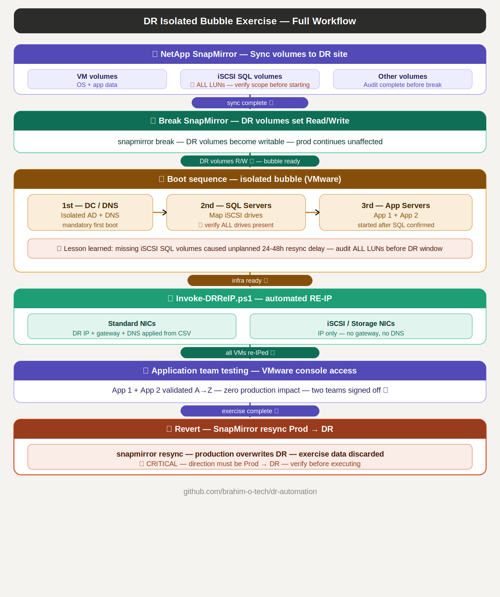

# dr-automation

> PowerShell toolkit for Disaster Recovery exercises — automated network re-IP for isolated VMware bubble DR testing with NetApp SnapMirror environments.

---

## Origin & Disclaimer

These scripts are derived from production DR workflows used in real enterprise environments.
They have been anonymized, refactored, and generalized for public release.

**Provided as-is, without warranty. Always validate in a lab environment before production use.**
**Always run with `-Simulate` first before applying any network changes.**

---

## Overview

In DR environments without L2 network extension (no stretched VLAN between sites),
VMs recovered at the DR site need to be re-IPed to match the DR network plan.
This toolkit automates that process for isolated bubble DR exercises.

| | Production site | DR site — Isolated bubble |
|---|---|---|
| VMs | Production IPs | Cloned from NetApp SnapMirror |
| Identity | AD + DNS prod | Isolated AD + DNS |
| Access | Normal network | VMware console only |
| Network | Connected to prod | Completely isolated |
| Re-IP | — | `Invoke-DRReIP.ps1` runs on each VM |

**Why isolated bubble:**
- Zero risk to production — completely isolated network
- Real application testing with actual DR data
- No public DNS or firewall changes needed
- Simple revert — destroy the bubble, SnapMirror resumes

---

## Real-world context

This toolkit was used to execute a full DR exercise covering two business-critical
application stacks — from SnapMirror break to application validation by the app teams.

**What was tested:**
- Full boot sequence in isolation — DC/DNS first, then SQL, then app servers
- iSCSI volume mapping for SQL servers (drives mapped directly inside VMs)
- Automated RE-IP via CSV — network team provided DR IPs, script handled the rest
- Application teams validated both apps end-to-end via VMware console
- Zero production impact throughout the exercise

**Lesson learned — iSCSI SQL volumes:**
During the exercise, SQL server drives mapped via iSCSI were missing at the DR site —
they had not been included in the initial SnapMirror replication scope.
An additional SnapMirror sync was required, introducing an unplanned 24-48h delay.

> **Takeaway:** Before any DR exercise, audit ALL volumes required by each VM —
> including iSCSI LUNs mapped directly inside VMs. These are easy to miss
> in the replication scope definition.
---

## Workflow

| Step | Script | Description |
|---|---|---|
| 1 — Pre-DR | `Export-NetworkConfig.ps1` | Export prod network config from all servers to CSV |
| 2 — Build DR config | Manual | Fill DR IPs in `DR-network_config.csv` using template |
| 3 — Deploy CSV | Manual | Copy CSV to `C:\Temp\DR-Exercise\` on each DR VM |
| 4 — Simulate | `Invoke-DRReIP.ps1 -Simulate` | Validate changes before applying |
| 5 — Apply | `Invoke-DRReIP.ps1` | Apply DR IPs — runs locally on each VM |
| 6 — Test | Manual | Validate applications via VMware console |
| 7 — Revert | Destroy bubble | SnapMirror resync restores prod data + config |



---

## Scripts

### `Export-NetworkConfig.ps1`

Collects network configuration from remote servers via WinRM and exports to CSV.
Use this before the DR exercise to build the baseline for the DR config file.

**Features:**
- Queries remote servers via `Invoke-Command`
- Collects: adapter name, IPv4 address, prefix length, gateway, DNS servers
- Supports hardcoded list or text file input
- Progress bar for large server lists
- Error handling — failed servers logged, processing continues

**Usage:**

```powershell
# Export from specific servers
.\Export-NetworkConfig.ps1 -ComputerName "SRV01","SRV02","SRV03"

# Export from file
.\Export-NetworkConfig.ps1 -InputFile "C:\DR\servers.txt" -OutputPath "C:\DR\NetworkConfig.csv"
```

---

### `Invoke-DRReIP.ps1`

Applies DR network configuration to the local server during a DR exercise.
Runs locally on each VM inside the isolated bubble.

**Features:**
- Backup of current IP config via `netsh dump` before any change
- Matches server hostname against CSV — safe to deploy same CSV to all VMs
- Removes production IP before applying DR IP
- Handles iSCSI/Storage adapters separately — IP only, no gateway, no DNS
- `-Simulate` switch for dry-run validation
- Full transcript for audit

**Usage:**

```powershell
# Always simulate first
.\Invoke-DRReIP.ps1 -Simulate

# Apply DR IPs
.\Invoke-DRReIP.ps1 `
    -CsvPath    "C:\Temp\DR-Exercise\DR-network_config.csv" `
    -DnsServers @("10.20.0.10","10.20.0.11")

# Custom backup path
.\Invoke-DRReIP.ps1 `
    -CsvPath    "C:\Temp\DR-Exercise\DR-network_config.csv" `
    -DnsServers @("10.20.0.10") `
    -BackupPath "D:\DR-Logs"
```

---

## CSV Format

Use `templates/DR-network_config-template.csv` as a starting point.

| Column | Description |
|---|---|
| `Hostname` | Server name — matched against `$env:COMPUTERNAME` |
| `NIC_Name` | Exact network adapter name |
| `PROD_IP` | Production IP address to remove |
| `PROD_Mask` | Production subnet mask |
| `PROD_GW` | Production default gateway |
| `DR_IP` | DR site target IP address |
| `DR_Mask` | DR site subnet mask |
| `DR_GW` | DR site default gateway |
| `ADM_GW` | Admin/management gateway to remove |

**Notes:**
- One row per NIC per server
- iSCSI/Storage adapters — leave `DR_GW` and `PROD_GW` empty
- `Hostname` must match `$env:COMPUTERNAME` exactly

**Example:**

```csv
Hostname,NIC_Name,PROD_IP,PROD_Mask,PROD_GW,DR_IP,DR_Mask,DR_GW,ADM_GW
SRV01,Ethernet,192.168.1.10,255.255.255.0,192.168.1.1,10.20.0.10,255.255.255.0,10.20.0.1,192.168.1.1
SRV01,iSCSI-NIC,192.168.2.10,255.255.255.0,,10.20.2.10,255.255.255.0,,
SRV02,Ethernet,192.168.1.11,255.255.255.0,192.168.1.1,10.20.0.11,255.255.255.0,10.20.0.1,192.168.1.1
```

---

## Repository Structure

| Path | Description |
|---|---|
| `src/Export-NetworkConfig.ps1` | Pre-DR network config export |
| `src/Invoke-DRReIP.ps1` | Automated re-IP during DR exercise |
| `templates/DR-network_config-template.csv` | CSV input template |
| `examples/` | Example invocations |
| `docs/images/` | Architecture diagrams |
| `LICENSE` | License file |
| `README.md` | This file |

---

## Requirements

| Requirement | Details |
|---|---|
| PowerShell | 5.1 or later |
| OS | Windows |
| Privileges | Administrator |
| WinRM | Enabled on target servers (Export-NetworkConfig) |
| VMware | vSphere environment with SnapMirror-replicated VMs |

---

## Security note

**Never commit real IP data to Git.**
The `.gitignore` excludes `DR-network_config.csv` and all backup files.
Only the template with placeholder IPs should be versioned.

---

## Author

**Brahim O.**
Derived from production DR exercise workflows in a VMware + NetApp SnapMirror enterprise environment.

---

## License

This project is licensed under the terms of the [LICENSE](LICENSE) file.
